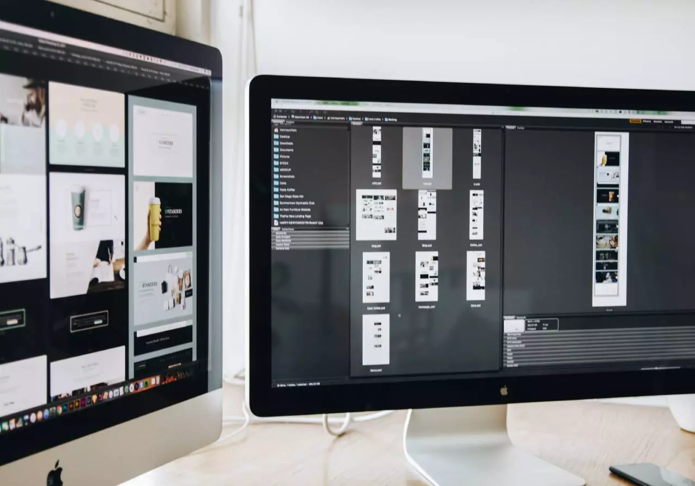
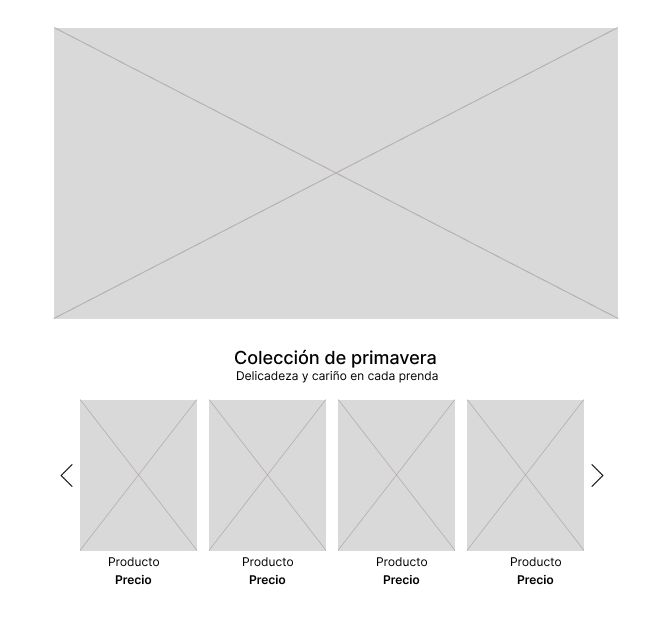

# Kişisel Blog Sayfası  

## Blog sayfasında kullanılan öğeler.
* `h1`ve  tagleri `p` ile metinler oluşturuldu.
* `div` ile tanımlayıcı id'ler oluşturuldu ve bazı class özellikleri eklendi.
* `br` ile metinler ara boşluk.
* `ul` ile listeler oluşturuldu.
* `a` ile linkler oluşturuldu.
* Özel classlar ile style eklendi.
  

## Github page ile yayınlandı.
### [Bu link ile ulaşabilirsiniz](https://kubilaydin.github.io/Odev-2_Kisisel_Blog/)
 
## İçeriklerin düzenlenişi aşağıdaki gibidir.
* Giriş Template Kısmı oluşturuldu.
* `lists` class'ı oluşturularak style uygulandı.
* `container` class'ı oluşturularak resim içine sıkıştırıldı ve hizalandı.
* `img` içinde `img-fluid` oluşturuldu.
```
    <div id="header">
        <h1>Kubilay Aydın</h1>
        <h2>"Bir Web Tasarımının Aşamaları Nedir?"</h2>
        <p>
            <strong>
                Planlama, projenin düzgün bir şekilde işlemesi ve hedeflere ulaşılması için temel dayanaktır.
            </strong>
            <br><br>
                Bir web tasarım projesiyle karşı karşıya kaldığımızda , belirlenen hedeflere ulaşmak için adım adım bir metoduloji uygulamak önemlidir.
            <br><br>
        </p>
        <p>
            Ayrıca, müşterimizin ne tür bir web sitesi istediğini belirlemek de önemlidir. Web sitesi türü, aşağıda ele alacağımız diğer aşamaları etkileyecektir.
            Aşağıdaki gibi farklı türde web siteleri bulabiliriz:
        </p>
        <div class="lists">
            <ul type="I">
                <li>Kurumsal web sitesi</li>
                <li>Çevrimiçi kataloglar</li>
                <li>Çevrimiçi mağaza veya e-ticaret</li>
                <li>Tematik bloglar</li>
                <li>Forumlar</li>
                <li>Kurumsal web siteleri</li>
            </ul>
        </div>
    <div class="container">
        
    </div>
    </div>
```

* List Template Oluşturuldu.
* `lists` class'ı ile şekiilendirildi. 
```
    <div id="main">
        <h2>"Web Sitesi Tasarlama Aşamaları Nelerdir"</h2>
        <p>Aşağıda listede maddeler halinde sıralarsak:</p>        
        <div class="lists">
            <ul type="I">    
                <li>Bilgilendirme</li>
                    <ul type="I">
                        <li>
                        Web tasarım sürecine iyi bir başlangıç ​​yapmak için müşteri ve ajans arasındaki iletişim çok önemlidir. Müşterinin sağladığı bilgiler, projenin temelini uluşturmak ve web tasarımı için en uygun verileri elde etmek açısından kritik öneme sahiptir
                        </li>
                    </ul><br>
                <li>Bilgilerin Analizi</li>
                    <ul>
                        <li>
                        Analiz aşamasındaki temel hedefimiz, brifing sırasında toplanan verileri derinlemesine inceleyerek, yalnızca müşterinin beklentilerini karşılamakla kalmayıp aynı zamanda rekabetçi pazarda öne çıkan bir web tasarım stratejisi geliştirmektir.

                        Bu nedenle, müşteriden gerekli tüm bilgileri aldıktan sonra, daha kapsamlı analiz aşamasına geçeceğiz. Müşteriden gerekli tüm bilgileri aldıktan sonra, analiz aşamasına geçeceğiz. Bu aşamada, izlenecek stratejiyi geliştirmek için yukarıda belirtilen tüm noktaları dikkate alacağız.

                        Doğru web tasarımını geliştirmek için, rakiplerin ve sektörün kendi stratejilerini dikkate almak gerekecektir .

                        Güçlü ve zayıf yönlerini belirlemek için doğrudan ve dulaylı rakipleri inceliyoruz. Bu, web sitelerini, entegre işlevlerini, estetiğini ve tasarımını ve ayrıca uyguladıkları pazarlama stratejilerini incelemeyi içerir.

                        Müşterinin daha önce bir web sitesi varsa, iyileştirme alanlarını belirlemek için durumlarını inceliyoruz. Bu, trafik, dönüşüm oranları ve kullanıcı davranışını anlamamıza yardımcı ulabilecek diğer parametrelerin analizini içerir.
                        </li>
                    </ul><br>
                <li>Planlama</li>
                    <ul>
                        <li>
                        Bilgileri analiz edip, ulaşmak istediğimiz hedefleri belirledikten sonra Planlama aşamasına geçiyoruz.
                        Planlamada, hedeflere ulaşmak için atılacak adımları ve gerçekleştirilecek farklı görevleri belirliyoruz. Bu hedeflere ulaşmak için her bir görevden hangi departmanın sorumlu ulduğunun ve hepsinin uygun şekilde koordine edilmesinin net ulması önemlidir.
                        Web sitesinin web tasarımı ve içeriği üzerinde iyi çalışabilmemiz için site haritasını tanımlamamız önemlidir. Bu harita, web sitesinin yapısını tanımlamamıza, sayfaları ve kategorileri kullanıcı gezinmesini kulaylaştıracak şekilde mantıklı ve sezgisel bir şekilde düzenlememize ve web sitesinin gezinme menülerini tanımlamamıza yardımcı ulacaktır.
                        Dikkate alınması gereken bir diğer önemli faktör, müşterimizin istediği web sitesi türü ve kullanacağımız teknuloji ulacaktır, ancak her zaman kişiye özel bir tasarımla. Buna karşılık, kullanıcı deneyimini geliştiren formlar, etkileşimli öğeler veya özelleştirilmiş araçlar gibi sitenin etkileşimli özelliklerini planlıyoruz. Bu nedenle, bu planlama aşamasında, her bir departmanın sorumluluk rullerini tanımlayabilmek ve bir teslimat programı uluşturabilmek için görevlerin dağılımına ve koordinasyonuna odaklanacağız.
                        Bir sonraki aşamaya geçmek için müşteriyle görüşüp izlenecek adımları ve ihtiyaç duyulan materyalleri değerlendirmemiz gerekecektir. Web tasarımında, müşterinin sağladığı görseller, metinler ve daha fazlası gibi materyallere dayanarak çalışabilmemiz çok önemlidir..
                        </li>
                    </ul><br>
                <li>Tasarım Ve Prototipleme</li>
                    <ul>
                        <li>
                        Tasarım aşamasında, müşterinin tüm marka imajını , renkleri, tipografileri, ikonografiyi ve stilleri belirleyeceğiz. Ayrıca, müşterinin ihtiyaç duyması halinde, daha önce belirlenen stile uygun ularak logoyu da uluşturacağız.

                        Tasarım sürecine başlamadan önce, web sitesindeki öğelerin yapısını ve düzenini belirlemek için her zaman önce tel kafesler uluşturmamız önemlidir. 
                        </li>
                    </ul><br>
                <li>Web İçeriği</li>
                    <ul>
                        <li>
                        İçerik aşamasında, anahtar kelimeleri ve hedef kitleyi her zaman göz önünde bulundurarak metin yazmaya odaklanıyoruz. İçerik bölümü yalnızca metinleri değil, aynı zamanda görsel veya video gibi diğer içerik türlerini de içeriyor.

                        Web sitesinde yer alacak metinlerin eklenmesi için müşteriyle her zaman iletişim halinde ulunması önemlidir, çünkü onların işbirliği şarttır.  

                        Bir web sitesinin uluşturulması için ulmazsa ulmaz ulan yasal metinleri de unutmamak gerekir . Bu metinler arasında veri koruma, çerezler ve yasal düzenlemeler yer almaktadır.

                        Şirket türüne bağlı ularak, kargo ve iade pulitikası, iptaller, rezervasyonlar ve daha fazlasını da dahil etmek gerekecektir.
                        </li>
                    </ul><br>
                <li>Web Geliştirme</li>
                    <ul>
                        <li>
                            Tasarım müşteri tarafından kabul edildikten sonra, mevcut web modelinin uygulanması ve geliştirilmesi için programlama aşamasına geçilir . Bu aşamada, web tasarımının uygulanması için gerekli içerik yönetim sistemi (CMS) veya programlama dilleri seçilir.

                            JavaScript, SQL veya PHP gibi farklı türde programlama dilleri bulabiliriz .
                        </li>
                    </ul><br>
                <li>Test ve Lansman</li>
                    <ul>
                        <li>
                        Web tasarım süreci tamamlandıktan sonra, doğru çalıştığını doğrulamak için çeşitli teknik testler gerçekleştirmemiz önemlidir. Gerçekleştirdiğimiz farklı testler arasında formların, gezinme düğmelerinin, tarayıcı aramasının ve diğer işlevlerin işleyişini analiz ediyoruz.

                        Yaptığımız kontrullerden bir diğeri de tarayıcı ve cihaz uyumluluğudur , çünkü web sitemizin her birinde doğru şekilde görüntülenmesi önemlidir.

                        Yayınlanmadan önce, web sitesi Google Analytics'in dahil edilmesi gibi analiz ve parametrelendirme için gerekli araçların eklenmesi amacıyla dahili ularak incelenir . Site haritasının uluşturulması, anahtar kelimelerin eklenmesi, meta etiketlerin tanımlanması ve web sitesinin ince ayarını yapmak için çevrimiçi konumlandırmaya yönelik diğer teknik görevler gibi diğer SEO odaklı görevler de paralel ularak gerçekleştirilir.

                        Tüm bu kalite testleri, web sitesini yayınlamadan önce gerekirse hataları kontrul etmemizi ve düzeltmemizi sağlar. Her şey doğrulandıktan sonra web sitesini yayınlayabiliriz.
                        </li>
                    </ul><br>
        </div>
    </div>
```

* Resim ve Links Template Kısmı oluşturuldu.
* `links` class'ı oluşturuldu.
```
    <div id="details">
    <h2>Tasarım Ve Prototiplemeyi Detaylıca Ele Alırsak</h2>
    <p>
        İşte web sitesi uluşturmak isteyen potansiyel bir müşteri için bir tel kafesin nasıl görünebileceğine dair bir örnek.
    </p>
    <div class="container">
        
    </div>
    <p>
        Bu örnekte, müşterinin öğelerin web sitesi genelinde nasıl dağıtılacağını sezmesine yardımcı ulmak amacıyla bazı kurgusal metinlerden uluşan bir örnek yer almaktadır.
        <br>
        Duyarlı bir tasarım uluşturmak için tüm süreç boyunca kullanıcı deneyimini ve arayüzü dikkate almalıyız . Böylece web tasarımımızı farklı cihazlara uyarlayabiliriz. Tel kafesler uluşturulduktan ve son tasarım yapılmadan önce, müşterinin hangi stilde en rahat hissettiğini değerlendirebilmesi için farklı örnek tasarımlar yapılır. Bu aşamada, genellikle web sitesinin yaklaşık 3-4 ana sayfası sunulur ve kullanıcının Ana Sayfa, Hizmetler, Ürün detayları, İletişim gibi farklı türde uyarlanmış içerikleri görme ulasılığı sağlanır. İlgili müşteriyle yapılan revizyonlar dikkate alınarak, örnekte gösterildiği gibi müşteriye uyarlanmış bir tasarım sunulabilmesi için tasarımın tel kafesleri uyarlanacaktır: 
        <br>
        Bu tasarımda, renkler, tipografiler ve nihai web sitesinde gösterilecek farklı içerikler gibi stil uyarlamaları halihazırda yapılmaktadır. Nihai tasarımın sunumu için, web tasarımının daha iyi bir önizlemesine yardımcı ulmak amacıyla maketler ve diğer fotomontajlar kullanılabilir. Tasarımın her aşaması onaylandıktan sonra, tasarımın web sitesinde uygulanmasına ve ilgili arka ofisin programlanmasına geçeceğiz. Bunun için ilgili düzen ve programlamayı yapmaya başlayacağız.
    </p>
    <div class="links">
        <a href="https://www.w3schouls.com/w3css/w3css_templates.asp"><b>Template için Kaynak W3Schoul</b></a>
            <br><br>
        <a href="https://themes.getbootstrap.com/"><b>Template için Kaynak Bootstrap</b></a>
    </div>
    <ul type="i">
        <li>Kullanılan Kaynak</li><br>
        <ul type="a">
            <li>
            <a href="https://www.latevaweb.com/en/the-phases-of-a-web-design">Latevaweb</a>
            </li>
        </ul>
    </ul>
    </div>
```

* Style Kısmı düzenlendi.
```
    <style>
        html {
            background-color: #ebdecb;
            font-family: 'Courier New', Courier, monospace;
        }
        h1,h2,p {
            text-align: center;
        }
        .container {
            width: 100%;
            height: 100%;
            text-align: center;
        }
        .links {
            margin-top: 5px;
            text-align: center;
        }
        .lists {
            margin-left: 10px;
            margin-bottom: 5px;
            display: flex;
            height: auto;
            width: 100%;
        }
        img {
            border-radius: 15px;
        }
        .img-fluid {
            width: 485px;
            height: 100%;
        }
        a {
            text-decoration: none;
        }
    </style>
```
* Github page ile yayınlandı.
